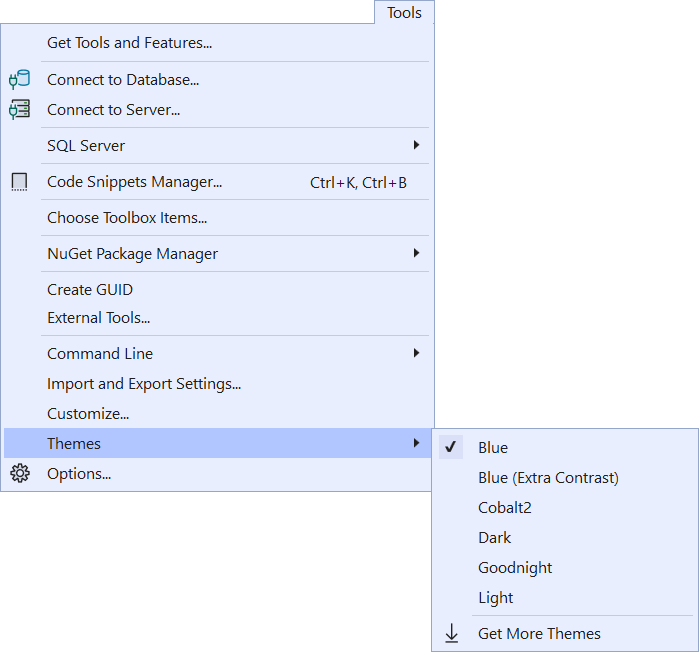

# Code Tours VS

Code Tours shows guided tours through any source code base. They are easy to create and easy to use.

Download this extension from the [Marketplace](https://marketplace.visualstudio.com/items?itemName=MadsKristensen.CodeTours)
or get the [CI build](https://www.vsixgallery.com/extension/ThemeSwitcher.26e69bc4-ab86-469a-ac8e-f9f16e77ff7e).

-----------------------------------------

This extension adds a submenu to the **Tools** top-level menu that lists all the installed themes. From here you can easily see which theme is the currently selected on and apply a different theme.

## License
[Apache 2.0](LICENSE)
